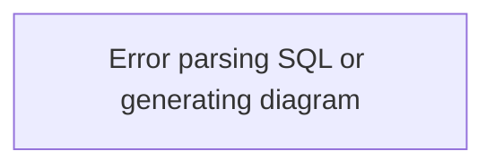

# copilot_blueprint.md — SQL-to-Flowchart Visualizer

## 0. Intent

We want a **small, clean, TypeScript-based web app** that:

1. Accepts **T‑SQL (SQL Server)** pasted into a textbox.
2. Parses it deterministically into an AST.
3. Extracts a **structured JSON “diagram spec”** (tables, joins, filters, group-by, nested subqueries).
4. Sends the spec to **OpenAI `gpt-4o-mini`** to generate **Mermaid `flowchart TD` code**.
5. Renders the Mermaid diagram in the browser.
6. Runs as a **single container** on **Google Cloud Run** (no Firebase, no Genkit).

This repo must stay **minimal**, readable, and free from duplicated logic.
Prefer small pure functions, clear boundaries, and no unnecessary abstractions.

Copilot should help:
- scaffold the repo,
- create all files listed here,
- keep code concise and focused,
- avoid copy-paste between modules.

---

## 1. Tech Stack

- **Language:** TypeScript (strict)
- **Runtime:** Node.js (LTS)
- **Backend:** Express (or minimal HTTP framework)
- **Frontend:** React + Vite (or Next.js if simplest) — keep it light
- **LLM:** OpenAI `gpt-4o-mini` via REST API (`openai` Node SDK or direct `fetch`)
- **SQL Parser:** `ts-sql-parser` configured for **T‑SQL**
- **Diagrams:** Mermaid (client-side rendering)
- **Deployment:** Docker container → Cloud Run
- **Config:** `.env` for `OPENAI_API_KEY`

Keep dependencies minimal; avoid heavy UI libraries.

---

## 2. High-Level Architecture

```
Browser
  ├─ React UI
  │    ├─ SQL textarea
  │    ├─ "Generate Diagram" button
  │    └─ Mermaid diagram pane
  │
  └─ Calls backend:
       POST /api/sql-to-diagram
         body: { sql: string }

Backend (Node + Express)
  ├─ parseSql(sql) -> AST         // ts-sql-parser
  ├─ buildDiagramSpec(ast)       // deterministic extraction
  ├─ callOpenAi(diagramSpec)     // gpt-4o-mini -> mermaid
  └─ return { mermaid: string }
```

We never send raw SQL to the LLM.  
We only send the **diagram spec JSON**.

---

## 3. Data Structures

Copilot should create `DiagramSpec` types in a shared module.

```ts
// shared/types/diagramSpec.ts
export interface TableSpec {
  id: string;          // short ID (A, B, C...)
  name: string;        // table name
  alias?: string;
}

export interface JoinSpec {
  fromTableId: string;
  toTableId: string;
  joinType: "INNER" | "LEFT" | "RIGHT" | "FULL" | "CROSS" | "UNKNOWN";
  condition: string;   // raw ON condition text
}

export interface FilterSpec {
  id: string;
  tableId?: string;    // optional table association
  expression: string;  // raw WHERE predicate text
}

export interface SubquerySpec {
  id: string;          // Q1, Q2...
  alias?: string;
  spec: DiagramSpec;   // nested spec
}

export interface DiagramSpec {
  tables: TableSpec[];
  joins: JoinSpec[];
  filters: FilterSpec[];
  groupBy: string[];
  select: string[];
  subqueries: SubquerySpec[];
}
```

The **only** thing the LLM sees is `DiagramSpec`.

---

## 4. Folder Structure

Copilot should scaffold the repo like this:

```text
/sql-flowchart-visualizer/
  package.json
  tsconfig.json
  vite.config.ts          # or next.config.js if Next
  .eslintrc.cjs
  .gitignore
  .env.example

  /src/
    /shared/
      types/
        diagramSpec.ts

    /backend/
      server.ts
      routes/
        sqlToDiagram.ts
      services/
        parseSql.ts
        extractDiagramSpec.ts
        openAiClient.ts
        mermaidFromSpec.ts  # prompt & API call wrapper

    /frontend/
      main.tsx
      App.tsx
      components/
        SqlInputForm.tsx
        DiagramViewer.tsx
        MermaidCodeBlock.tsx
```

Later, add a `/docker/` folder if needed, or keep Dockerfile at root.

Avoid duplicating type definitions between backend and frontend; re-use `/shared/types`.

---

## 5. Backend Responsibilities (Copilot: generate code)

### 5.1 `server.ts`

- Create Express app.
- JSON parsing middleware.
- Mount `/api/sql-to-diagram` route.
- Serve frontend (static build) in production.

Keep this file short and focused.

### 5.2 `routes/sqlToDiagram.ts`

- `POST /api/sql-to-diagram`
- Body: `{ sql: string }`
- Validate `sql` presence and length.
- Call `parseSql`, `extractDiagramSpec`, `mermaidFromSpec` in order.
- Return `{ mermaid: string, spec: DiagramSpec }`.

On parse or LLM error:
- Respond with `400` and a minimal fallback Mermaid like:



### 5.3 `services/parseSql.ts`

- Use `ts-sql-parser` configured for T‑SQL.
- Expose async `parseSql(sql: string)` → AST.

Requirements:

- Catch parse exceptions and throw a typed error that the route can handle.
- Keep function pure (no logging side effects except optional debug).

### 5.4 `services/extractDiagramSpec.ts`

- `extractDiagramSpec(ast: any): DiagramSpec`
- Deterministically walk AST and populate:
  - `tables` (FROM + JOIN + subqueries)
  - `joins` (JOIN clauses)
  - `filters` (WHERE predicate expressions, split if necessary)
  - `groupBy` (raw group-by expressions)
  - `select` (raw select expressions)
  - `subqueries` (nested SELECTs)

Rules:

- Keep extraction logic deterministic and as simple as possible.
- Prefer small helper functions over a single huge function.
- Do **not** interpret business logic; just capture structure.
- For T‑SQL features that are hard to model, fall back to raw strings.

### 5.5 `services/openAiClient.ts`

- Wrap OpenAI API calls.
- Read `OPENAI_API_KEY` from environment.
- Export `async function getMermaidFromDiagramSpec(spec: DiagramSpec): Promise<string>`.

Prompt strategy:

- Instruct `gpt-4o-mini` to output **only**:

  ```
  ```mermaid
  flowchart TD
  ...
  ```
  ```

- Format rules for Mermaid:

  - Tables as large blocks:
    `A[Visits]`
  - Joins as arrows with labels:
    `A -->|Visits.PatientID = Patients.ID| B`
  - Filters as subgraphs per table:
    ```mermaid
    subgraph Filters_for_Visits
        F1[Visits.Acuity IN (1,2,3)]
        F2[Visits.Age > 65]
    end
    A --> F1
    A --> F2
    ```
  - Subqueries as nested subgraphs:
    ```mermaid
    subgraph Subquery_Q1
        ...
    end
    ```

- Always use short node IDs (A, B, C, F1, F2, Q1).

- If the spec is empty or invalid, return a simple diagram instead of throwing.

### 5.6 `services/mermaidFromSpec.ts`

- This can either:
  - call `openAiClient` directly, or
  - be a thin wrapper that prepares the prompt and calls OpenAI.

Keep it lean; avoid unnecessary layers. If it ends up being tiny, merge it with `openAiClient` to prevent duplication.

---

## 6. Frontend Responsibilities (Copilot: generate code)

### 6.1 `frontend/main.tsx`

- Standard React/Vite entry.
- Render `<App />` into `#root`.

### 6.2 `frontend/App.tsx`

- High-level layout:
  - Left: SQL input + button
  - Right: diagram viewer + Mermaid code block

- Keep state hooks simple:
  - `sql`, `setSql`
  - `diagram`, `setDiagram`
  - `spec`, `setSpec`
  - `isLoading`, `error`

### 6.3 `components/SqlInputForm.tsx`

- Props: `{ sql, onSqlChange, onSubmit, isLoading }`.
- Textarea with monospace font.
- “Generate Diagram” button.
- Basic validation: disable button if SQL empty.

### 6.4 `components/DiagramViewer.tsx`

- Props: `{ mermaidCode: string }`.
- Use Mermaid JS to render diagram in a `div`.
- Re-render when `mermaidCode` changes.
- Show placeholder text when no diagram is available.

### 6.5 `components/MermaidCodeBlock.tsx`

- Props: `{ mermaidCode: string }`.
- Show a `<pre><code>` with the Mermaid block.
- Optionally a “Copy” button.
- Do not add complex syntax highlighting; keep it minimal.

---

## 7. Example Flow

Copilot should ensure the path from input to diagram is clear:

1. User pastes:

   ```sql
   SELECT s.Site, COUNT(*) AS VisitCount
   FROM EDVisits v
   INNER JOIN Sites s ON v.SiteId = s.Id
   WHERE v.Acuity IN (1,2,3) AND v.VisitDate >= '2024-01-01'
   GROUP BY s.Site;
   ```

2. Backend parsing and extraction yields:

   ```ts
   const spec: DiagramSpec = {
     tables: [
       { id: "A", name: "EDVisits", alias: "v" },
       { id: "B", name: "Sites", alias: "s" }
     ],
     joins: [
       {
         fromTableId: "A",
         toTableId: "B",
         joinType: "INNER",
         condition: "v.SiteId = s.Id"
       }
     ],
     filters: [
       { id: "F1", tableId: "A", expression: "v.Acuity IN (1,2,3)" },
       { id: "F2", tableId: "A", expression: "v.VisitDate >= '2024-01-01'" }
     ],
     groupBy: ["s.Site"],
     select: ["s.Site", "COUNT(*) AS VisitCount"],
     subqueries: []
   };
   ```

3. OpenAI returns Mermaid:

   ```mermaid
   flowchart TD
       A[EDVisits v]
       B[Sites s]

       A -->|v.SiteId = s.Id| B

       subgraph Filters_for_EDVisits_v
           F1[v.Acuity IN (1,2,3)]
           F2[v.VisitDate >= '2024-01-01']
       end

       A --> F1
       A --> F2
   ```

4. Frontend renders this diagram and shows the code.

---

## 8. Cloud Run Deployment (Copilot: create basics)

- Add a **Dockerfile** at repo root:

  - Multi-stage build (install deps, build, then run).
  - Expose port `8080` by default.
  - Command: `node dist/backend/server.js` (or equivalent).

- Add a short `README` section with:

  ```bash
  docker build -t sql-flowchart-visualizer .
  docker run -p 8080:8080 sql-flowchart-visualizer
  ```

- Cloud Run will use this container with minimal extra config.

Keep Dockerfile concise.

---

## 9. Clean Code & No Duplication — Explicit Instructions to Copilot

Copilot must:

1. **Avoid duplicate type definitions.**
   - All diagram-related types live in `shared/types/diagramSpec.ts`.
   - Import them wherever needed.

2. **Prefer small, single-purpose functions.**
   - `parseSql` only parses.
   - `extractDiagramSpec` only walks AST and builds the spec.
   - `getMermaidFromDiagramSpec` only talks to OpenAI.

3. **Avoid unnecessary abstraction layers.**
   - If a file ends up with a single tiny wrapper that just passes data through, merge it into an existing service.

4. **Keep files short and focused.**
   - If a service file grows too big, split by purpose (e.g., helpers for WHERE extraction).

5. **Document only where needed.**
   - Add brief JSDoc-style comments on key public functions.
   - Do not generate heavy comments for trivial code.

6. **Error handling should be simple and user-oriented.**
   - Return small diagrams on error, not stack traces.
   - Log errors on the server console in a minimal, readable way.

7. **No over-engineering.**
   - Do not introduce Redux, complex routing, or heavy UI frameworks.
   - A small React app with a single page is enough.

---

## 10. What Copilot Should Generate Next

When starting from this blueprint, Copilot should:

1. Scaffold the folder structure and basic config files.
2. Implement:
   - `parseSql.ts`
   - `extractDiagramSpec.ts`
   - `openAiClient.ts`
   - `sqlToDiagram.ts` route
   - `server.ts`
3. Scaffold the React frontend:
   - `main.tsx`, `App.tsx`
   - `SqlInputForm.tsx`, `DiagramViewer.tsx`, `MermaidCodeBlock.tsx`
4. Add a minimal Dockerfile.
5. Add a short `README.md` with setup & run instructions.

All code must be **complete, TypeScript-correct, and ready to paste into the repo** without extra boilerplate.

